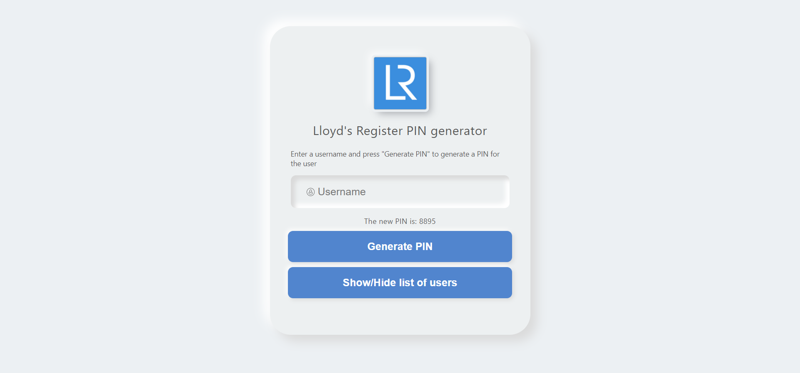

# Lloyd's Register PIN generator

This is a web application that generates random numbers to be used as PIN-s for users.

## Table Of Contents

- [Demo](#demo)
- [Getting Started](#getting-started)
  - [Prerequisites](#Prerequisites)
  - [Installation](#installation)
- [About the project](#about-the-project)
- [Technologies](#technologies)
- [Usage](#usage)
- [Roadmap](#roadmap)

## Demo



## Getting Started

### Prerequisites

To run the project you will need Node installed on your computer.

### Installation

- Save or clone the repository from https://github.com/DavidGuere/Pin-generator.

  - To save the zip file click on the "Code" button and then on "Download ZIP"
  - To clone the repository open the terminal in your desired directory and run the `git clone` command:
    ```sh
    git clone https://github.com/DavidGuere/Pin-generator.git
    ```

- Run the following code to install the necessary modules:
  ```sh
  npm install
  ```
- Run the `npm` command to run the project locally on your computer in development mode:

  ```
  npm start
  ```

## About the project

This web application randomly generates a 4 digit number to be used as a PIN. To application does not generate simple PIN-s such as 1111 or 4444 and does not generate the same PIN for two different users. The application is a responsive website built following an MVC pattern.

## Technologies

- JavaScript: A high-level programming language.
- React: An open-source, front end, JavaScript library for building user interfaces or UI components.
- HTML: Hypertext Markup Language is the standard markup language for documents designed to be displayed in a web browser.
- CSS: A style sheet language used for describing the presentation of a document written in HTML.

## Usage

To use the application simply enter a username for the new user and click on "Generate PIN" to generate a new PIN.

To view all the users and their respective PIN, click on "Show/Hide list of users" and click on it again to close the list.

## Roadmap

Currently, the data is only available for a single user and on a single browser. If the user switches to a different browser, the information stored in the other browser will not persist.

The application does not clear the data stored in the user's browser. To clear the data follow the next steps:

- Chrome:
  1. Press F12.
  2. Select “Application” in the console's top menu.
  3. Select “Local Storage” in the console's left menu.
  4. Right-click your site(s) and click clear to delete the local storage.
- Firefox:
  1. Press F12.
  2. Select "Local Storage" in the console's top menu.
  3. Right-click your site(s) and click clear to delete the local storage.
- Edge:
  1. Press F12.
  2. In the console type: `localStorage.clear()`
